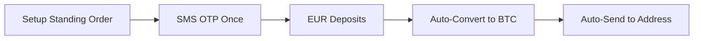

# Striga API Documentation Analysis
## Building a Frictionless Bitcoin Wallet with Fiat Off-Ramps

**Analysis Date**: January 18, 2025  
**Documentation Source**: https://docs.striga.com  
**Total Pages Analyzed**: 156

---

## Executive Summary

This analysis examines the Striga API documentation to identify the optimal paths for building a frictionless Bitcoin wallet that automatically converts received Bitcoin to EUR and distributes it to either virtual debit cards or external bank accounts. The analysis focuses on minimizing user friction while maintaining compliance with regulatory requirements.

## Table of Contents

1. [Authentication Requirements Overview](#authentication-requirements-overview)
2. [User Stories and Friction Analysis](#user-stories-and-friction-analysis)
3. [Optimal Implementation Paths](#optimal-implementation-paths)
4. [KYC Tiers and Limitations](#kyc-tiers-and-limitations)
5. [Recommendations](#recommendations)

---

## Authentication Requirements Overview

### Types of Authentication in Striga

1. **API Key Authentication**: Required for all API calls (backend only)
2. **Email Verification**: One-time during onboarding (code: "123456" in sandbox)
3. **SMS Verification**: One-time during onboarding (code: "123456" in sandbox)
4. **SMS OTP**: Required for sensitive transactions
5. **Email OTP**: Required for viewing card details (combined with SMS OTP)
6. **3D Secure**: For online card transactions
7. **MFA/2FA**: Required for hosted card features

### Key Finding: Transaction-Level Security

Striga implements a tiered security model where:
- **Receiving funds**: No additional authentication required
- **Internal operations**: No OTP for conversions or internal transfers
- **External operations**: Always require SMS OTP

---

## User Stories and Friction Analysis

### 🟢 Lowest Friction Operations (No Additional Auth)

| Operation | Prerequisites | Additional Auth | Notes |
|-----------|--------------|-----------------|-------|
| Receive Bitcoin | KYC Tier 1 | None | Direct to wallet address |
| Receive Lightning | KYC Tier 1 | None | Via Lightning invoice |
| Convert BTC → EUR | KYC Tier 1 | None | Internal operation |
| View balances | KYC Tier 1 | None | Read-only operation |
| Internal transfers | KYC Tier 1 | None | Same user, same category |

### 🟡 Medium Friction Operations (One-Time Setup)

| Operation | Prerequisites | Additional Auth | Notes |
|-----------|--------------|-----------------|-------|
| Create virtual card | KYC Tier 1 + MFA | 2FA setup required | One-time setup |
| Whitelist BTC address | KYC Tier 1 | None | Required before withdrawals |
| Setup standing order | KYC Tier 1 | SMS OTP once | Auto-converts EUR→BTC |

### 🔴 High Friction Operations (Always Require Auth)

| Operation | Prerequisites | Additional Auth | Notes |
|-----------|--------------|-----------------|-------|
| SEPA bank transfer | KYC Tier 1 | SMS OTP | Every transaction |
| BTC withdrawal | KYC Tier 1 + Whitelist | SMS OTP | Every transaction |
| Lightning withdrawal | KYC Tier 1 | SMS OTP | Every transaction |
| View card PAN/CVV | KYC Tier 1 | SMS + Email OTP | Both required |

---

## Optimal Implementation Paths

### Path 1: Bitcoin → EUR → Virtual Card (Recommended)

**Total Friction Score: Low**


**Advantages**:
- One-time setup process
- No OTP for receiving or converting
- No OTP for card spending (except 3DS when required)
- Instant availability of funds

**Implementation Steps**:
1. User completes KYC Tier 1
2. Setup MFA (required for hosted cards)
3. Create virtual card linked to EUR account
4. Generate Bitcoin/Lightning addresses
5. Implement auto-conversion on receive

### Path 2: Bitcoin → EUR → Bank Account

**Total Friction Score: Medium-High**


**Disadvantages**:
- SMS OTP required for every transfer
- SEPA processing time (1-2 business days)
- Higher operational overhead

### Path 3: Standing Orders (Automated Flow)

**Total Friction Score: Low (after setup)**



**Use Case**: Reverse flow - automatically convert EUR deposits to BTC

---

## KYC Tiers and Limitations

### Tier 0 (No KYC)
- ❌ Cannot create wallets
- ❌ Cannot receive funds
- ❌ Cannot create cards

### Tier 1 (Basic KYC)
- ✅ Create wallets and receive funds
- ✅ Create virtual cards
- ✅ Perform conversions
- ⚠️ Transaction limits apply
- ⚠️ Withdrawal limits apply

### Tier 2 (Enhanced KYC)
- ✅ Higher transaction limits
- ✅ Higher withdrawal limits
- ⚠️ May require minimum deposit
- ⚠️ Manual review process
- ⚠️ Source of Funds documentation

### Tier 3 (Full KYC)
- ✅ Highest limits
- ✅ All features available
- ⚠️ Extensive documentation required

---

## Recommendations

### For Maximum User Adoption

1. **Implement Path 1** (Bitcoin → EUR → Card)
   - Lowest overall friction
   - One-time setup, then seamless operation
   - No repeated OTP requirements

2. **Start with Tier 1 KYC**
   - Sufficient for most use cases
   - Faster approval process
   - Upgrade to Tier 2 only when limits are reached

3. **Key Implementation Features**:
   ```javascript
   // Pseudo-code for optimal flow
   async function setupFrictionlessWallet(user) {
     // One-time setup
     await user.completeKYCTier1();
     await user.setupMFA();
     const card = await user.createVirtualCard();
     
     // Generate receiving addresses
     const btcAddress = await user.getBitcoinAddress();
     const lightningInvoice = await user.getLightningInvoice();
     
     // Setup auto-conversion
     await user.enableAutoConversion('BTC', 'EUR');
     
     return { card, btcAddress, lightningInvoice };
   }
   ```

### For Compliance and Security

1. **Maintain Audit Trail**: Log all conversions and transactions
2. **Implement Velocity Checks**: Monitor for unusual patterns
3. **User Education**: Clear communication about one-time verifications
4. **Progressive Disclosure**: Only request higher KYC tiers when needed

### Technical Considerations

1. **Webhook Implementation**: 
   - Monitor deposit webhooks for instant conversion
   - Handle card transaction webhooks for reconciliation

2. **Error Handling**:
   - Graceful degradation if auto-conversion fails
   - Clear user communication for OTP requirements

3. **Rate Limiting**:
   - Respect API limits
   - Implement exponential backoff

---

## Conclusion

Building a frictionless Bitcoin wallet with Striga is achievable by focusing on the **Bitcoin → EUR → Virtual Card** flow. This path requires only one-time authentication setup and then operates seamlessly without repeated OTP requirements. The key is to minimize external transfers (which always require OTP) and maximize the use of internal operations (which don't require additional authentication).

For users who need bank transfers, consider batching operations or providing clear value propositions for why the additional security step is necessary. The standing orders feature could also be leveraged for automated flows, though it works in reverse (EUR → BTC) from the stated use case.

---

**Generated**: January 18, 2025  
**Scraper Version**: 1.0.0  
**Documentation Version**: Striga API (Latest as of scraping date)